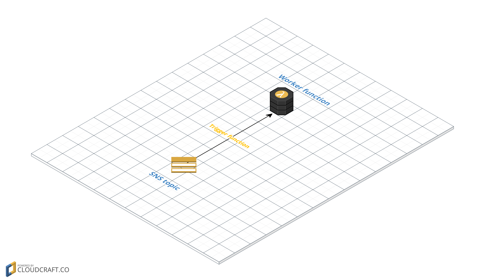
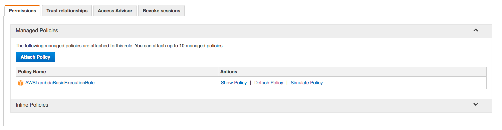
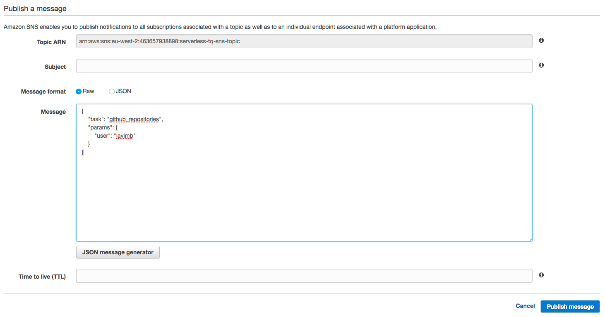
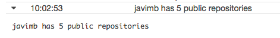

# Serverless task queue using SNS as message broker



## Lambda function

You can find function's code in [handler.py](handler.py).
We have defined two simple tasks that will just print some messages based on the parameters. These messages can be found in CloudWatch Logs.

### Message

```json
{
    "task": "github_repositories",
    "params": {
        "user": "javimb"
    }
}
```

### Role permissions for the lambda function

The role assigned to the lambda function has to include the `AWSLambdaBasicExecutionRole` in order to write logs into CloudWatch Logs.



## SNS topic

We need to create a SNS topic which will trigger our lambda function.
When a message is published in the SNS topic, the lambda function will be triggered and it will use the messafe to choose and execute the proper task.

### Limitations

Although connecting a SNS topic to a lambda function is pretty straightforward, using a SNS topic as message broker has some limitations.
SNS topics are a pub/sub mechanism, so messages that are sent to the topic when the lambda function is not connected to it are lost. Failed tasks will be lost too.

### Triggering a task

We just need to send a valid task message to the topic:



To see the results in CloudWatch logs:


