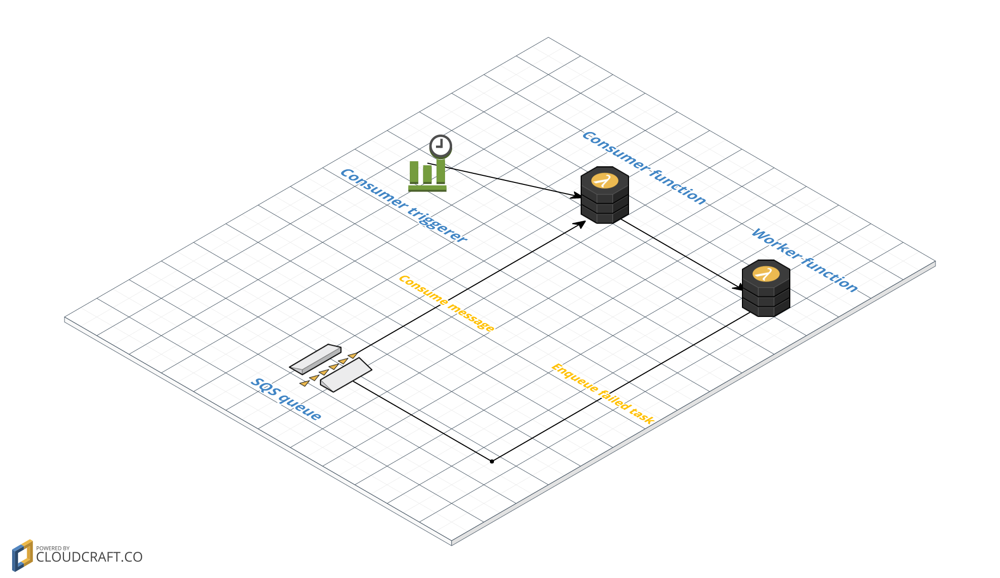
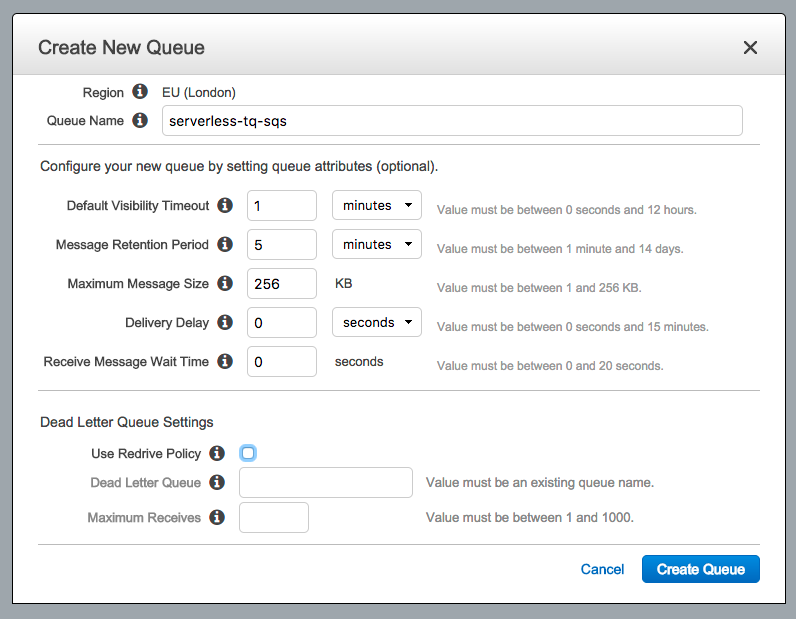
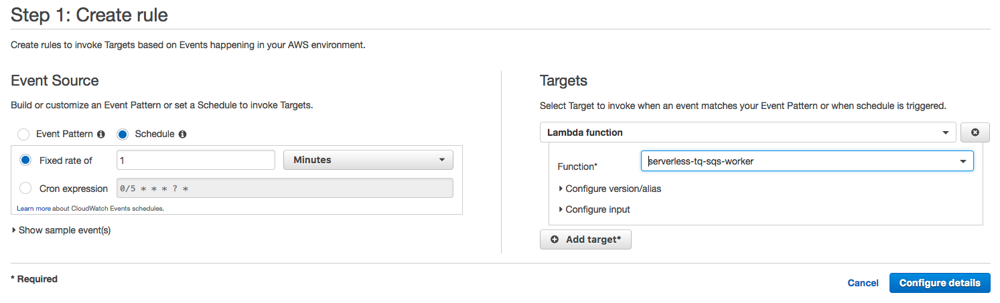
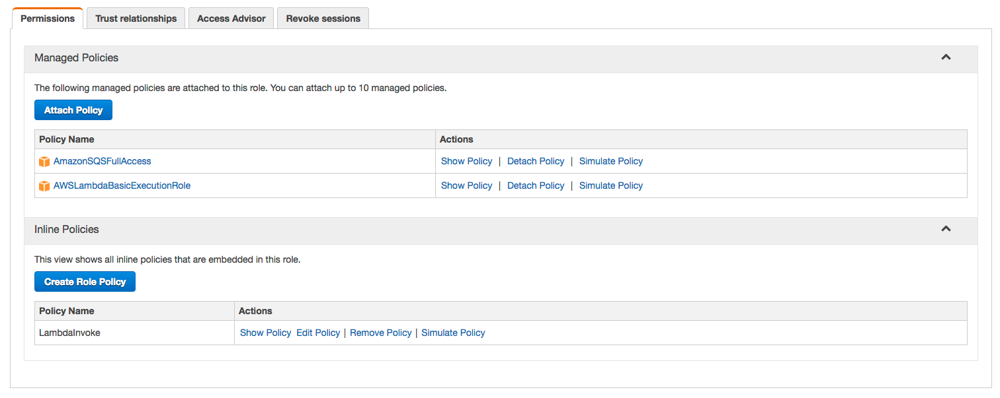
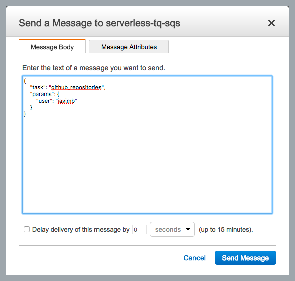
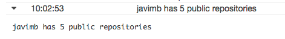

# Serverless task queue using SQS as message broker



## SQS queue

We need to create a SQS queue, which will be our message broker, with the following config parameters:



This way all messages are retained during 5 minutes, so we won't loose any task if the consumer function is not consuming messages from the queue during less than 5 minutes.

## Lambda functions

There is not a reactive way of consuming messages from an SQS queue using a Lambda function. So in this case we need two functions: [consumer](consumer.py) and [worker](worker.py).

Consumer function will be triggered periodically using an CloudWatch Rule:



This function will consume messages from the SQS queue and will invoke the worker for each message.

Worker function is responsible of executing the proper task. It will use the task registry to find the task function and execute it. If the execution fails, the task will be enqueued again.

### Role permissions for the lambda functions

The role assigned to the lambda functions has to include the following policies:

- `AWSLambdaBasicExecutionRole` in order to write logs into CloudWatch Logs.
- `AmazonSQSFullAccess` in order to send, delete and consume messages from a SQS queue.
- The following custom policy called `LambdaInvoke` in order invoke lambda functions:

```json
{
    "Version": "2012-10-17",
    "Statement": [
        {
            "Sid": "Stmt1495551970000",
            "Effect": "Allow",
            "Action": [
                "lambda:InvokeFunction"
            ],
            "Resource": "*"
        }
    ]
}
```



### Message

```json
{
    "task": "github_repositories",
    "params": {
        "user": "javimb"
    }
}
```

### Triggering a task

We just need to send a valid task message to the SQS queue:



To see the results in CloudWatch logs:



## Limitations

- If a task always fails, it will never be removed from the queue and it will be executed infinitely.
- SQS messages are not consumed in a reactive way, so there could be a delay when a task is enqueued until it's executed.
- This approach requires a lot of configuration.

## Improvements

I will work in the following improvements:

- Proper task registry and tasks (probably using modules and classes)
- Limit task's executions
- Build a long polling consumer
- Each task could trigger new tasks
